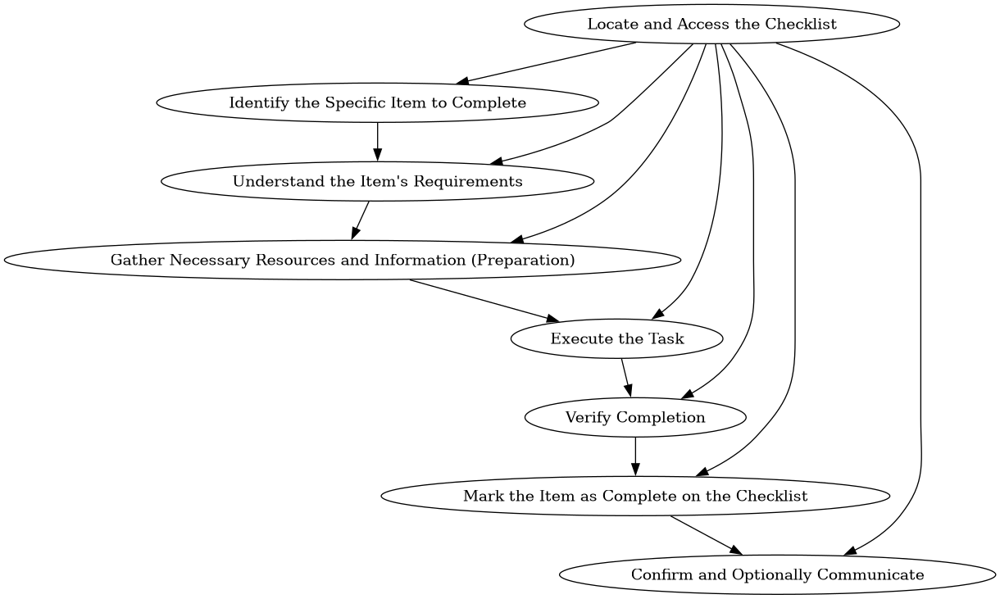

# Project Dependency Graph

Hand it a goal. It breaks the goal into steps, works out which steps block which, and renders the result as a Graphviz DAG.



*Note the root node with an edge to nearly everything downstream — that's redundancy the pipeline doesn't yet prune. See Known limitations.*

## How it works

Four stages, alternating between reasoning and formatting:

```
goal -> decompose -> extract steps -> analyze dependencies -> extract edges -> render
        (free-form)  (JSON)           (free-form)             (JSON)
```

The alternation is the point. Asking a model to reason carefully *and* emit valid JSON in the same call degrades both — you get clean JSON wrapped around shallow reasoning, or good reasoning in a response that doesn't parse. Splitting them lets each call do one job. The thinking stages are allowed to be verbose and exploratory; the formatting stages only have to transcribe something that already exists.

## Files

**`v2.py`** — the current version, implementing the pipeline above.

**`main.py`** — v1, kept as the baseline: a single structured call against a hardcoded task list. It's what the pipeline is measured against, and it still works if all you have is a list of tasks and you want edges between them.

A larger refactor is in progress.

## Running it

```
nix develop                    # or Python 3 with google-generativeai and graphviz
export GEMINI_API_KEY="..."    # never hardcode it
python v2.py
```

Graphviz needs to be installed system-side, not just the Python binding. The goal is set near the top of `v2.py`.

## Known limitations

**Redundant edges aren't pruned.** If A blocks B and B blocks C, the model will usually also emit A → C. It isn't wrong, but it's noise, and it's what makes the example image above hard to read. Transitive reduction is the fix and it isn't implemented yet.

**Nodes are keyed by task text.** Stage 4 re-emits step strings when naming edge endpoints. If it paraphrases one by a single word, Graphviz creates a new node rather than raising an error — the render then shows two tasks where there is one, with the original left floating unconnected. Stage 4 receives both the step list and the reasoning, so it usually matches, but "usually" is carrying weight it shouldn't. Assigning IDs at stage 2, carrying them through stages 3 and 4, and resolving to text only at render is the fix.

**Compound steps stay compound.** "Return home and reflect on the trip" is two tasks; nothing decomposes recursively.

**Cycles aren't detected.** Nothing verifies the result is actually acyclic before rendering it as a DAG.

**Input and output paths are hardcoded.**

##

This README was written by an AI assistant.
